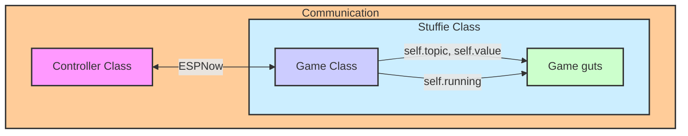

## Playground code

Things seem to work.  Move the folder structure down on to a plushie - then replace main.py with the one in games - and then run this code on a different ESP to change the game.

```python
import utilities.now as espnow
import time, json

def my_callback(msg, mac, rssi):
    print(mac, msg, rssi)
    n.publish(msg, mac)

n = espnow.Now(my_callback)
n.connect()
print(n.wifi.config('mac'))

test = json.dumps({'topic':'/game', 'value':1})
stop = json.dumps({'topic':'/game', 'value':-1})

n.publish(test)
```


## Stuffie Game Ideas for December 8/9/10:
1. find the plushie --- hot and cold
1. find the note --- rotate to note or click to "pick up the note", ---> each stuffie is assigned a note "bell choir"
1. shake to fill the color bar in random colors
1. counting jumps (taps) .... using pips to show the count of taps (up to 6)
1. if you can hear me clap, one person presses a button. ..... everyone in a certain range gets a vibration/buzz. If you feel a buzz take a step forward.

## How it all works

